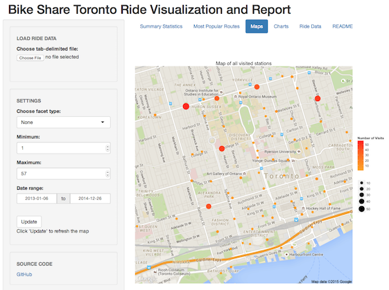

# Bike Share Toronto Ride Report

A Shiny app takes your personal ride data from [Bike Share Toronto](https://www.bikesharetoronto.com/) 
and creates a collection of summary reports and charts of your ride usage.

A demo is available here: https://kcha.shinyapps.io/bike_share_ride_report/



## Requirements
 * R 3.1.1+ plus the following packages:
  * assertthat
  * dplyr
  * ggmap
  * ggplot2
  * rjson
  * stringr
  * shiny
  * weatherData

Run the following command in your R console to install the above R packages:
```r
install.packages(c("assertthat", "ggplot2", "ggmap", "dplyr", "rjson", "stringr", "shiny", "weatherData"))
```

## Usage

### Station data

Bike station geolocation data is obtained from https://tor.publicbikesystem.net/ube/stations

### Getting ride data

Currently, the only way to get ride data is to log into your Bike Share Toronto
online account and manually copy and paste all of your trip data to a text file. 
This could take a while if you have hundreds of trips that span multiple pages.
The format of the trip data should be exactly as it appears when viewing your 
data online (including the headers). 
See [`sample_data/ride_data.txt`](https://github.com/kcha/bike_share_ride_report/blob/master/sample_data/ride_data.txt) (fake data) for an example.

### Starting the Shiny app

To start the app on your local machine, run the following command in your R console:
```r
shiny::runGitHub('bike_share_ride_report', 'kcha')
```

## Disclaimer
This is a personal project and not affiliated with Bike Share Toronto.
